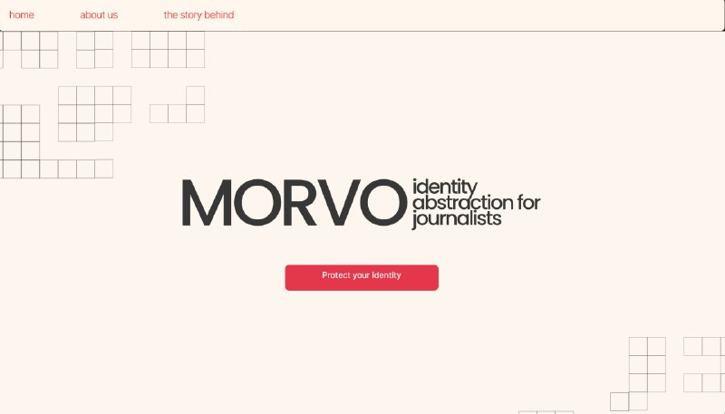

<h1 align="center">
  <br>
  
</h1>

<h4 align="center" style="font-size:20px">Identity abstraction for journalists </h4>
<h4 align="center" style="font-size:15px"> 
<a href="
https://docs.google.com/presentation/d/1AATWpKTOEoX1aQM3b8TXcb057cyDUWlRWxHjmlhzNYw/edit" target="_blank">Pitch Deck</a>
&
<a href="
https://ethglobal.com/showcase/morvo-u0hph" target="_blank">Website</a>
</h4>

<p align="center">
  <a href="#about">About</a> •
  <a href="#key-concepts">Concepts</a> •
  <a href="#how-to-use">How To Use</a> •
  <a href="#the-team">Credits</a> •
</p>

<h1 align="center">
<a href="https://morvo.vercel.app/">
  
</a>
</h1>

## About

Morvo is born after identifying that journalist compromise their lives when investigating topics such as drug trafficking, war, or mafia, in an effort to expose and change the hardest parts of our world. These heroes are left unprotected, and many times killed by those who they were reporting. 

The opportunity to protect them is clear, and the technology to do so is in our hands. Not even stopping there, but also moving the power back to their hands, allowing them to be more independent with a new business model based on minting their stories. 

Morvo, leveraging ZK tech, allows them to mint a credential that links directly to their identity (through World ID) and connects to Lens in order to build their own private profile where they can sell their articles. These allows for a marketplace structure where posts are made, and these are minted by newspapers for them to be published in their newspapers. 

Journalists are given a profile where they can post their articles, but also track the performance these have had when published. In this way, even when posting anonymously, they still get all the benefits that may come from the article posted since these can be directly related to their identity.                         

Newspapers can filter from the trending topics, as well as identify the writers with better engagement, and the stories that are more successful. These can help them make decision for what they want to mint and post based on metrics of the platform.                        

Finally, the platform acts as a new medium for newspaper and journalist communication, bringing back the power to those who should have it, allowing them to investigate whatever they want safely, and potentially finding a niche in the right newspapers. 

This project was built during <a href="https://ethglobal.com/showcase/morvo-u0hph">ETH Global</a> hackathon.

## Key Concepts
TL;DR: Noir, Lens Protocol, Next.js, Solidity

Morvo relies on the <u>Noir</u> language from <u>Aztec</u> for constructing the zero-knowledge proof circuit, originally designed for anonymous airdrops like those facilitated by <a href="https://github.com/stealthdrop/stealthdrop">stealthdrop.xyz</a> and the <a href="https://github.com/noir-lang/noir-examples/tree/master/stealthdrop">implementation on Noir</a>. In adapting this technology for Morvo, the focus shifts to creating "credentials" for journalists and newspapers.

The process involves several key components:

- Merkle Tree: Morvo initiates with the creation of a Merkle tree, serving as a vector commitment scheme. This allows for the commitment of a list of addresses by publishing the root hash on-chain.

- Zero-Knowledge Proof: The circuit utilizes zk-SNARKs to prove specific conditions, including the origin of an ECDSA signature, the association of the signature's public key with the Merkle tree, and the non-malleability of the signature's hash.

- Merkle Tree Path Proofs: The straightforward process of checking Merkle path proofs involves traversing the path and hashing node children at each step. Design choices revolve around the privacy of the list of addresses eligible for the airdrop.

- Nullifier Hash Construction: To prevent multiple claims, a unique identifier, known as the "nullifier hash," is created. The circuit employs ECDSA signatures, passing them through a one-way function to scramble the signature and maintain address anonymity.

- Bringing it Together: The generation of proofs poses a technical challenge due to the large size of the ECDSA circuit. A dedicated server is used for compiling the proving key, and a clever chunking mechanism is implemented to optimize the process.

- On-chain Contract: The on-chain contract involves checking the validity of a proof and redeeming tokens accordingly. Challenges include addressing the privacy implications of assigning multiple tokens to an address and facilitating gas payments for claiming without compromising identity.

- Frontrunners as Relayers: Inspired by surrogeth, Morvo uses frontrunners as relayers. Claiming transactions reward ETH to the initiator, making frontrunners relay transactions for claimers at a higher gas price, addressing the challenges of decentralized relayer networks.

- We have also implemented a second way to do this in the repo branch called "worldcoin-implement", where we use anonymous actions in order to proof that a public key is part of a list of keys and then they have the chance to choose another wallet to claim the credential.

- Morvo's approach incorporates these components to create a comprehensive and privacy-focused system for minting credentials and managing the airdrop process.

- Once claimed, Lens protocol should come into play for the social aspect. Once a journalists has its credential, they are able to create articles and publish anonymously, but keeping their credentials. Each article is tokenized as an NFT, and newspapers can mint these articles by purchasing them, adding a distinct dimension to the journalism ecosystem.

## How To Use

To clone and run this application, you'll need [Git](https://git-scm.com) and [Node.js v18.15.0](https://nodejs.org/en/download/) (which comes with [npm](http://npmjs.com)) installed on your computer.
```bash
# Clone this repository
$ git clone https://github.com/luzalbaposse/Morvo-App.git

# Go into the repository
$ cd Morvo-App
```

In the ```main``` branch journalists can verify using Worldcoin ID:
```bash
# go into the next app repo
$ cd morvo-v2

# Install dependencies
$ npm install

# Run the app in localhost
$ npm run dev
```

In the ```noir-app``` branch journalists can verify using Noir (wallet connect not working):
```bash
# go into the noir app repo
$ cd noir-app

# Install dependencies
$ npm install

# run local node using hardhat 
$ npx hardhat node 

Open a new terminal

# compile te circuit and contracts
$ npm run compile

# deploy your contract to the network 
$ NETWORK=Localhost npm run deploy

# move to the next-app folder and run the app
$ cd ../morvo-v2 & npm install & npm run dev

```


## The Team

<h1 align="center">
    
</h1>
